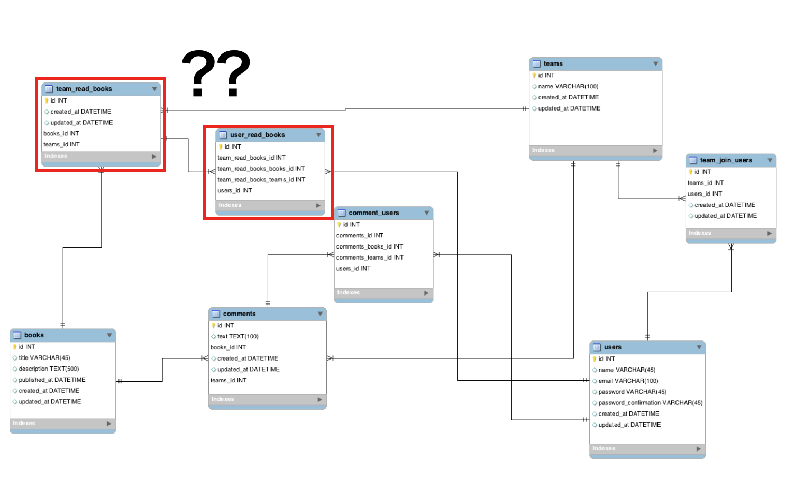
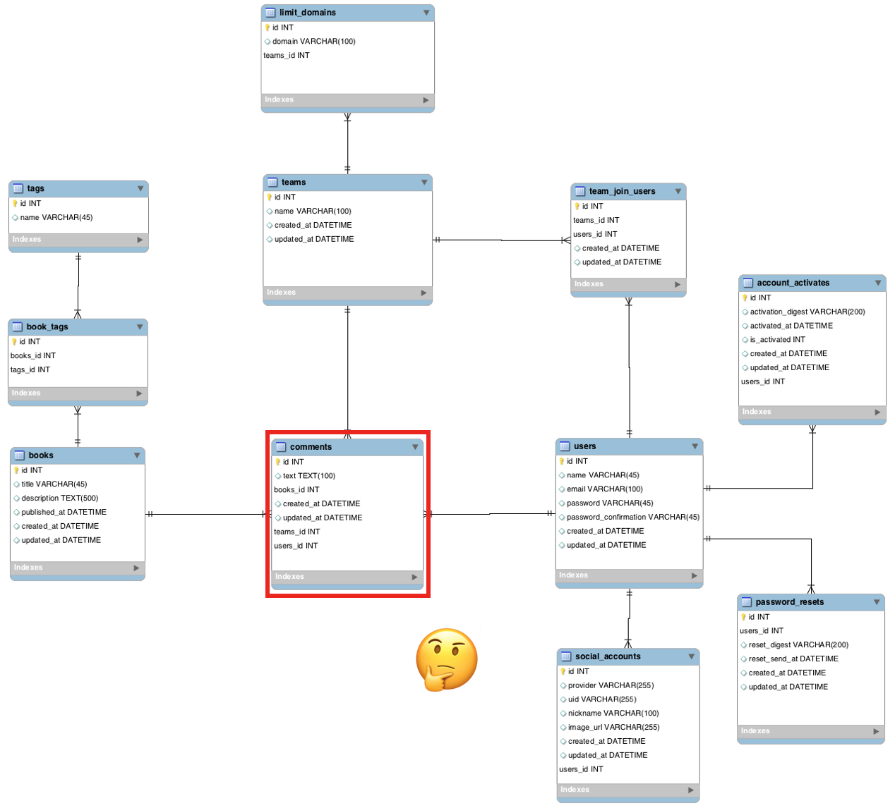
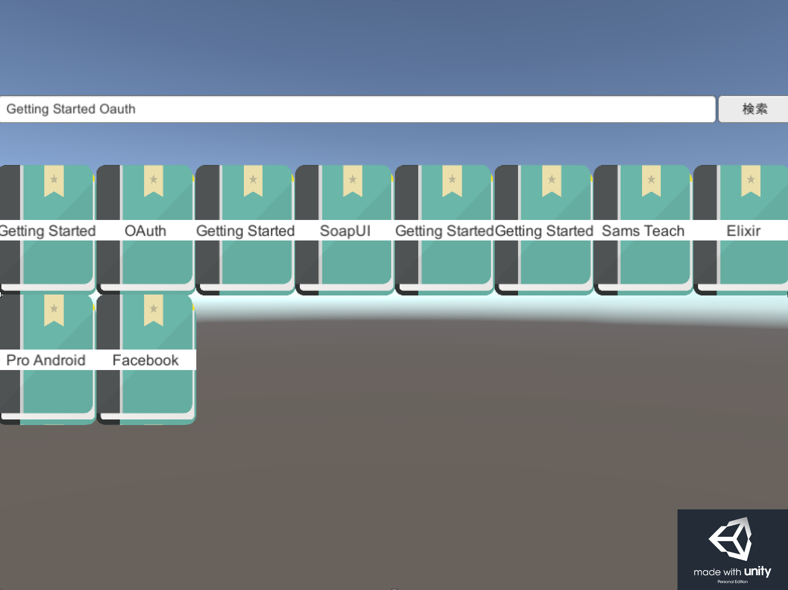

title: Hondana!アプリケーションを作ったよ！
author: Kazuma Takeda

# 自己紹介

<center>
  
</center>

- 武田和馬
- 技術部
- 技術以外ではリラックマと嵐が好きです。

# アジェンダ

- Hondana！を作ったよ！
- 目的はなんなのか？
- デモ
- こだわった部分
- 開発こんなことした
- まとめ

# 1ヶ月でHondana！を作ったよ！

## Hondana!ってなんなの？

- みんなの本棚を投稿するプラットフォーム。

- esa.ioよりも手軽にチームで本を投稿できるもの。

- ブクログのチーム管理版。

# 目的はなんなのか？

##「Railsを利用して<font style="color:red">正しくウェブアプリケーションを作れる」

- アプリケーションをリリースするのが目標ではない
- アプリケーションを作成しながら正しいRailsの使い方を覚える
- 研修でやってきたことを使ってみる

# Demo!

<center>
  
</center>

# きちんと頑張った部分

- データベースの設計
- OOPを意識した(FormObject, Decorator, 責務の切り分け)
- 興味あることにチャレンジ

# データベース設計(はじめ)

<center>
  
</center>

よくわからない結びつきがいっぱい...。

- team_read_books?チームが本をよむの？
- しかもそこからuser_read_booksに伸びてる?

# データベース設計(改良)

<center>
  
</center>

- だいぶ細かく分割できた
- コメントがつくと必然的にチームの読んだ本に入る
- はじめよりはよくなった

# 開発でこんなことした

- Unityでフロント側の実装を行った
- GolangのメソッドをRubyで呼んでみた

# RailsをJson吐き出しして別アプリケーションで受け取る

- 今回はRails×Unityで行った
- 文字化けするが未対応
- 本一覧と検索まではできる

<center>
  
</center>

# Golangについて

- RubyからGolangを呼び出すにはSharedLibraryにビルドすればOK。
- Gem FFIでSharedLibraryをよびだせる
- 簡単に呼び出せることをしった。
- 初Golang。

```go:sample.go
package main

import "C"

//export add
func add(a, b int) int {
  return a + b
  }

func main () {}
```

## 結果

- 今回はバッチにするところまで行かなかった。
- Rubyと比較検証したかった(簡単な計算でもいいのでベンチマーク)

# まとめ

## 良かった点

## もやもや
- Rails難しい。
- 一番データベース設計が難しい。
